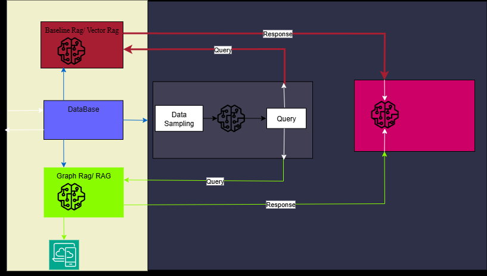
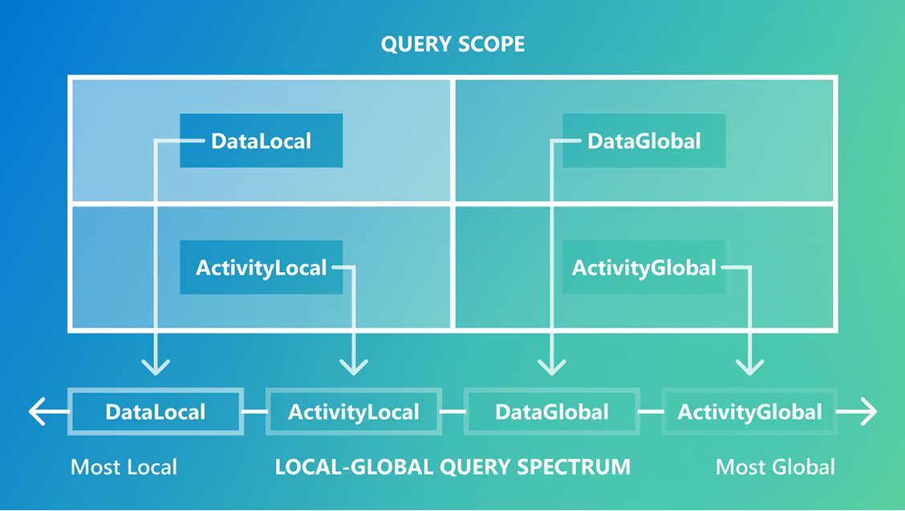

# Graph RAG Evaluation Pipeline

A production-ready framework for evaluating and benchmarking RAG systems with automated query synthesis and LLM-as-a-judge evaluation.

)

## Project Objectives

This project provides a systematic approach to evaluate Retrieval-Augmented Generation (RAG) systems, with particular focus on Graph RAG architectures. The framework addresses key challenges in RAG evaluation:

- **Fair Comparison**: Standardized evaluation across different RAG implementations
- **Query Coverage**: Balanced assessment of both local (specific) and global (thematic) information needs
- **Automated Scaling**: LLM-driven query generation and evaluation for consistent, reproducible benchmarks
- **Production Readiness**: End-to-end pipeline for continuous monitoring and system comparison

## System Flow

### 1. Graph RAG Foundation
The evaluation framework is built around Graph RAG as the primary architecture under test, which:
- Constructs entity-level knowledge graphs from document collections
- Generates hierarchical community summaries for global reasoning
- Handles both local (entity-neighborhood) and global (community-summary) retrieval patterns
- Enables comprehensive evaluation across the local↔global query spectrum

### 2. Automated Query Synthesis

**Purpose**: Generate balanced, reusable question sets that cover the full range of information-seeking behaviors.

**Process**:
- **LLM-Generated Candidates**: Use large language models to create diverse question pools
- **Four-Class Taxonomy**: Organize queries along two dimensions:
  - **Scope**: Local (specific details) vs Global (general themes)  
  - **Source**: Data-driven (from text content) vs Activity-driven (from user scenarios)
- **Balanced Selection**: Cluster, rank, and filter candidates to ensure even representation across all query types
- **Reproducible Labeling**: Maintain query metadata for stratified reporting and analysis

**Output**: Labeled question sets spanning DataLocal, ActivityLocal, DataGlobal, ActivityGlobal classes

### 3. Automated Evaluation
**Purpose**: Score RAG system responses objectively and consistently using LLM-as-a-judge methodology.

**Process**:
- **Response Generation**: Each RAG system processes the same query set to produce comparable outputs
- **Pairwise Comparison**: Judge LLM compares response pairs across multiple quality dimensions:
  - **Comprehensiveness**: Addresses all relevant aspects of the question
  - **Relevance**: Directly answers what was asked
  - **Diversity**: Presents varied perspectives and insights
  - **Empowerment**: Helps readers make informed decisions
- **Statistical Validation**: Significance testing and A/A baseline checks ensure reliable results
- **Multi-Trial Scoring**: Counterbalanced trials reduce bias and improve measurement reliability

**Output**: Win rates, statistical significance tests, and detailed performance breakdowns by query class

## Core Components

